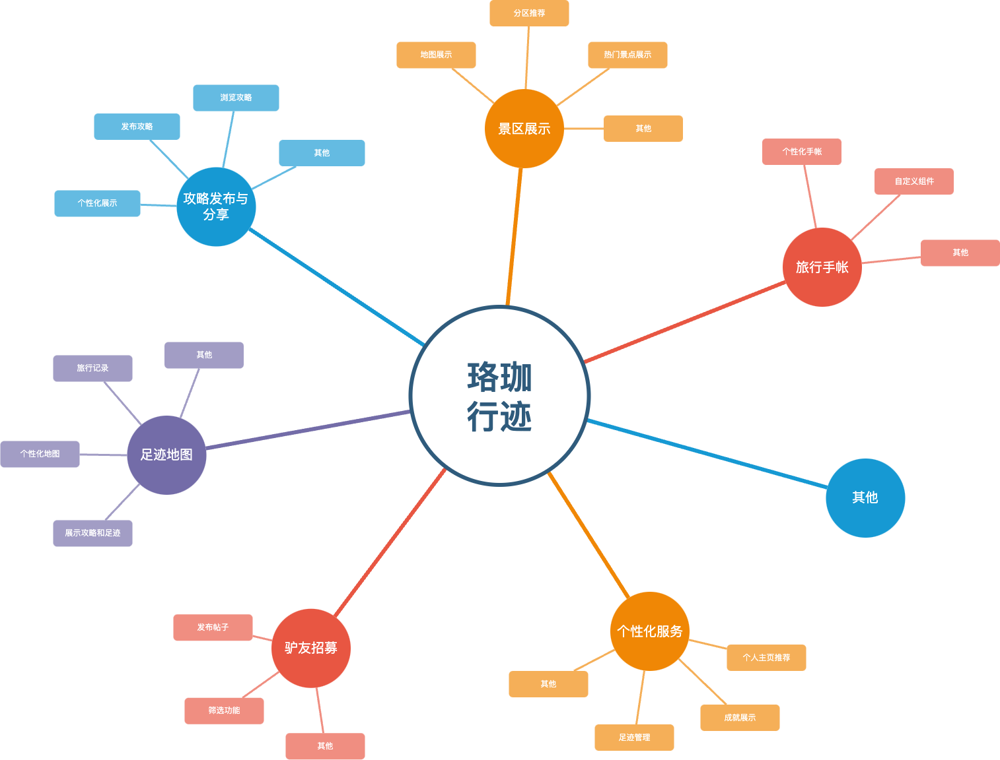

## 2024年9月20日第一次会议

---

### 1. 确定选题

在第一次会议期间，组员通过头脑风暴讨论，最终决定了项目选题为**武汉市旅行交友攻略手帐微信小程序**，项目名称为**珞珈行迹**。该小程序的目标是为武汉市内的游客和本地居民提供一站式的旅行信息、个性化手帐记录以及交友服务。

- **现有产品的不足**：目前市场上虽然有许多旅游类的APP和小程序，但大多功能较为单一，主要集中在景点介绍或攻略分享。部分应用可能会提供手帐功能，但设计较为简陋，缺乏灵活性。此外，市场上的大多数驴友招募类产品，筛选功能不够强大，无法满足用户的精准需求。

- **改进方式**：因此，我们的小程序结合了景区展示、个性化手帐、旅行攻略、足迹地图和驴友招募，提供了一站式的全方位服务，同时避免了广告干扰和隐私安全问题，能更好地满足用户需求。

### 2. 选题思维导图

小组成员共同讨论并通过思维导图的方式，明确了项目的主要功能和服务方向：

- **景区展示**：覆盖武汉市的所有景区，包括地图展示、分区推荐、热门景点展示等。
- **旅行手帐**：提供个性化手帐功能，支持用户通过贴纸和自定义组件来记录旅行。
- **攻略发布与分享**：用户可以发布并浏览多图、标签的旅行攻略，系统会根据推荐算法提供个性化展示。
- **足迹地图**：基于用户的旅行记录生成武汉市个性化足迹地图，展示攻略和足迹。
- **驴友招募**：支持用户发布招募驴友的帖子，提供筛选功能，帮助用户找到合适的旅行伙伴。
- **个性化服务**：包括用户的足迹管理、成就展示及个人主页推荐。

- **思维导图**:

### 3. 会议记录

- 会议时间：2024年9月20日
- 参与人员：郑云鲲、王雯琪、黄俊、李宗泽
- 会议议程：
  - 讨论项目选题，最终确定为“武汉市旅行交友攻略手帐微信小程序”。
  - 确定项目的核心功能模块：景区展示、旅行手帐、攻略发布与分享、足迹地图、驴友招募。
  - 针对每个模块进行初步的需求分析，明确功能的细节和实现可能性。
  - 讨论潜在的市场需求，确认项目的用户群体为武汉市居民、游客及有旅行社交需求的用户。
  - 下一次会议将分配后续任务，每个成员负责初步功能设计，以及后续讨论。

### 4. 确定需求分析的NABCD模型

会议最后，团队根据讨论的结果，形成了完整的NABCD需求分析模型，详细见[NABCD需求分析](NABCD.md)

---

