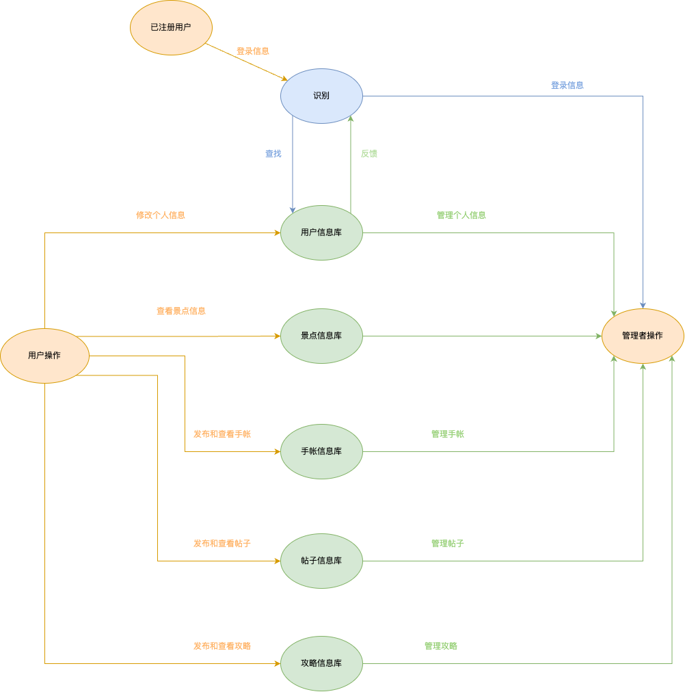
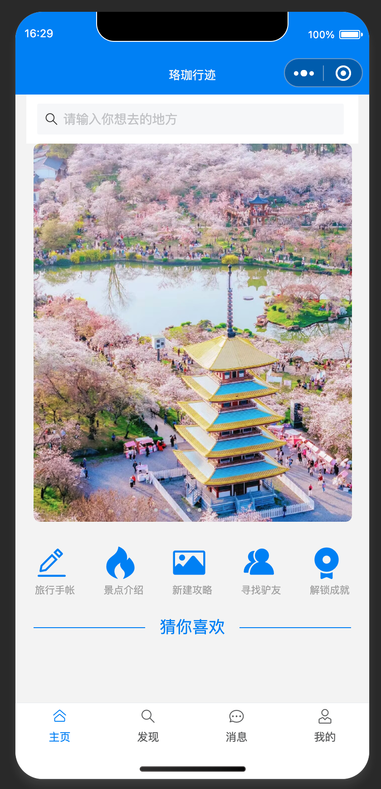
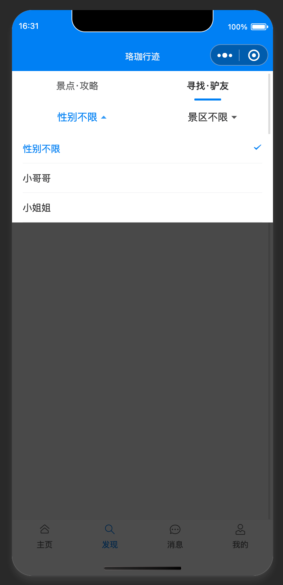
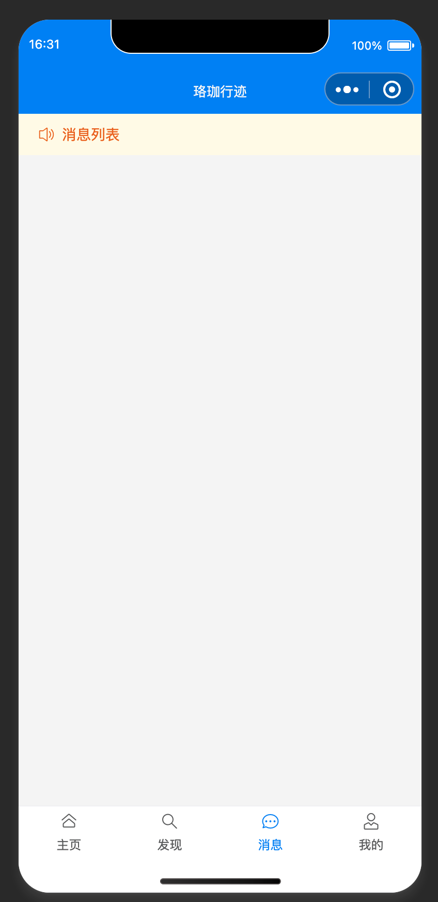
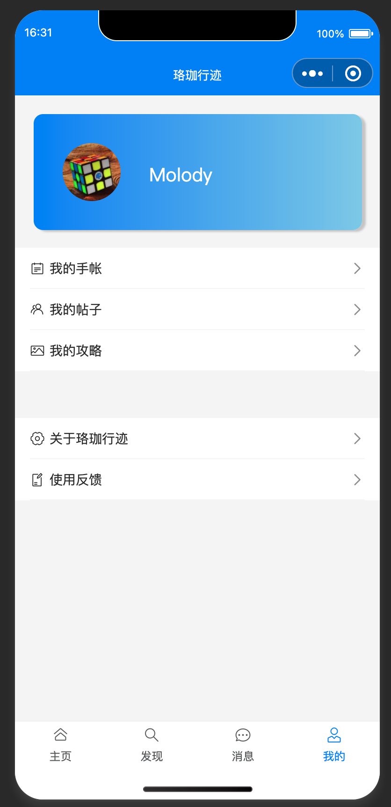

### 产品描述
经过小组讨论，我们决定以微信小程序的形式实现我们的“珞珈行迹”项目，为武汉市内的游客和居民提供一站式的旅游信息、个性化手帐记录及交友服务。项目代码和资源将通过 Gitee 平台进行管理，并租用服务器部署后端服务，实现基于微信平台的用户数据存储和景点信息展示。

我们的基本目标是为用户提供丰富的旅行信息、旅行记录工具和社交功能，让他们能够享受个性化的旅游体验，并与其他游客或本地居民进行社交互动。

---

### 产品功能
**珞珈行迹** 针对不同武汉市游客提供不同的功能：
   - **景区展示**：涵盖武汉市所有景区，并提供详细的地图和景点介绍，用户可以按季节、热度及区域查询景点。
   - **旅行手帐**：提供丰富的贴纸、组件，可自由编写、设计个性化的旅行手帐，生成预览图并保存至相册。
   - **攻略发布与发现**：支持用户发布多图、多标签的旅行攻略，并通过发现页的瀑布流展示，用户可以为攻略点赞，获取实时消息通知。
   - **足迹地图**：基于用户的旅行攻略生成个性化足迹地图，点击足迹地图中的地点会展示相关的攻略卡片。
   - **驴友招募**：提供招募驴友的功能，用户可以发布、筛选并查找旅行伙伴，建立线下或线上交流圈。
   - **个性化服务**：包括“我的足迹”、“我的成就”等模块，帮助用户管理个人内容，提供定制化的旅行服务体验。

---

---

### 系统数据流图
**珞珈行迹** 系统的数据流图如下，展示了从用户交互到后台处理的主要流程：

---

### 系统 ER 图
根据前述的产品功能和系统需求，系统的 ER 图如下，展示了用户、景区、手帐、攻略、驴友招募等实体之间的关系：

---

### 主页面

