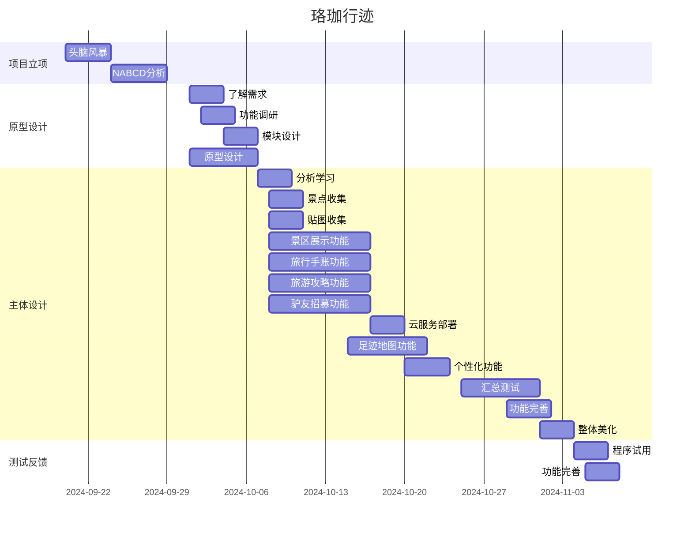

```mermaid
gantt
    title 珞珈行迹
    section 项目立项
    头脑风暴           :2024-09-20,4d
    NABCD分析    :2024-09-24,5d
    section 原型设计
    了解需求      :2024-10-01,3d
    功能调研      :2024-10-02,3d
    模块设计      :2024-10-04,3d
    原型设计      :2024-10-01,6d
    section 主体设计
    分析学习      :2024-10-07,3d
    景点收集      :2024-10-08,3d
    贴图收集     :2024-10-08,3d
    景区展示功能      :2024-10-08,9d
    旅行手账功能     :2024-10-08,9d
    旅游攻略功能      :2024-10-08,9d
    驴友招募功能      :2024-10-08,9d
    云服务部署       :2024-10-17,3d
    足迹地图功能      :2024-10-15,7d
    个性化功能      :2024-10-20,4d
    汇总测试      :2024-10-25,7d
    功能完善      :2024-10-29,4d
    整体美化      :2024-11-01,3d
    section 测试反馈
    程序试用      :2024-11-04,3d
    功能完善      :2024-11-05,3d

```

