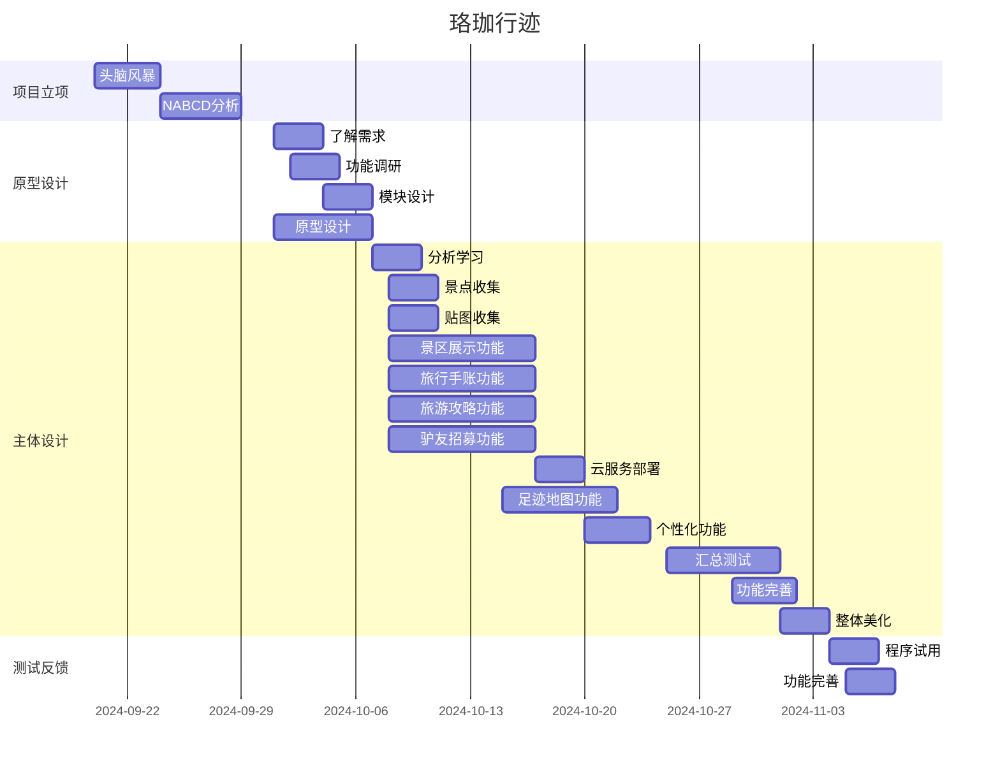

## 任务分解

任务安排：

前端搭建：郑云鲲、黄俊
- 创建微信小程序项目
- 设计页面结构和布局
- 实现基本页面（如首页、景区展示、旅行手账、旅游攻略等）
- 实现用户登录和注册功能
- 实现主要功能模块
- 与后端API对接

后端搭建：郑云鲲
- 创建微信小程序云开发项目
- 设计数据库结构
- 实现用户认证和授权
- 实现主要功能模块的云函数（如景区展示、旅行手账、旅游攻略等）
- 部署后端服务

数据收集：王雯琪
- 确定数据来源（如公开API、合作伙伴等）
- 编写数据爬虫或脚本收集数据
- 清洗和处理数据
- 存储数据到数据库
- 定期更新数据
- 确保数据的准确性和完整性

云环境配置：郑云鲲、李宗泽
- 配置微信小程序云开发环境
- 配置数据库
- 配置存储服务
- 配置云函数

